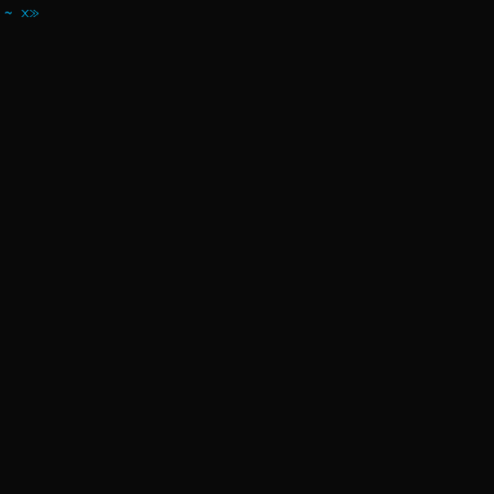

## Gitano CLI **WIP**

##### --- Early alpha ---

#### An opinionated CLI tool for setting up your React.js projects

Gitano will guide the user through a series of steps to help with the project setup.

---

**Install**  **MAKE SURE YOU HAVE GIT INSTALLED**

`npm install -g gitano-cli`

**Run**  

`gitano`

Gitano-Cli will prompt:  

0 - **What's your project name?**
* (wait for user's answer)

1 - **What do you want to work on?**
* [React-starter](https://github.com/juanmnl/react-starter)
* React-starter + Redux *(not available yet)*
* React-starter + Redux + Relay *(not available yet)*

2 - **What CSS framework do you want to use?**
* Bootstrap
* Foundation *(not available yet)*
* Bulma *(not available yet)*
* None

3 - **What testing suite do you want to use?**
* Mocha/expect/expect-jsx *(not available yet)*
* Mocha/enzyme/chai/sinon *(not available yet)*
* Ava *(not available yet)*
* None

---
